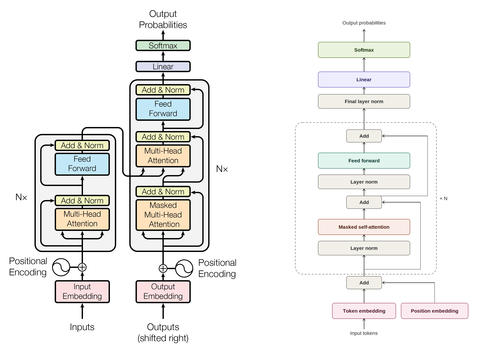

# minigpt

This will be a GPT-2-style transformer, coded from scratch largely following Andrej Karpathy's [nanoGPT](https://github.com/karpathy/nanoGPT/tree/master). I will possibly fine-tune it and make some improvements on the UI and efficiency.

This is not trying to be something fancy, but merely a way for me to force myself to learn to inner workings of transformers.

> **Status: on hold.** Training this locally on my M4 MacBook Air turned out to be impractical — no CUDA support, inconsistent/unavailable mixed-precision support on MPS, and throughput too low to iterate on anything beyond toy runs. Picking this back up will likely mean moving training off local hardware first.

## Changes to nanoGPT

The model is architecturally identical to Karpathy's nanoGPT — same pre-norm Transformer blocks, causal self-attention via `scaled_dot_product_attention`, GELU-based MLP, and weight tying between the token embedding and the output head. The differences are:

- **Fully spelled-out naming.** Every module, variable, and config field uses a descriptive name instead of nanoGPT's compact ones (`c_attn` → `query_key_value_projection`, `wte`/`wpe` → `token_embedding_table`/`position_embedding_table`, `n_embd` → `embedding_dimension`, etc.). The point of this project is to force myself to actually understand each piece, so I optimized the code for reading over terseness.
- **Apple Silicon support alongside CUDA.** Added `get_device()` and `synchronize_device()` helpers so the same training loop runs on MPS, CUDA, or CPU, since I'm developing on an M4 Air rather than an Nvidia GPU.
- **Defensive mixed-precision handling.** Rather than assuming bf16/fp16 autocast works, the training loop probes the current device with a small matmul before committing to a dtype, and falls back to float32 if neither works — MPS support for this is inconsistent across PyTorch versions. This ended up being a big bottleneck.
- **Gradient accumulation**, to allow a larger effective batch size than fits in memory at once on limited local hardware.

## Differences to "the" Transformer

On the left is the Transformer architecture from [Attention Is All You Need](https://arxiv.org/abs/1706.03762), and on the right is ours.

Since this project follows GPT-2's architecture (via nanoGPT) rather than the original paper's, the main differences are:

- **Decoder-only, no encoder.** The original paper describes an encoder-decoder architecture for sequence-to-sequence tasks (translation). This project keeps only the decoder stack, since it's trained purely as a language model.
- **No cross-attention.** With no encoder, there's nothing for a decoder to attend to besides its own previous tokens — so each block has just one attention sublayer (causal self-attention) followed by the feed-forward sublayer, rather than the original's self-attention → cross-attention → feed-forward sequence.
- **Pre-normalization instead of post-normalization.** LayerNorm is applied *before* each sublayer (attention or feed-forward) here, with the sublayer's output then added to the residual stream. The original paper normalizes *after* the residual addition. Pre-norm is the choice GPT-2 made for training stability at depth.
- **Learned positional embeddings instead of fixed sinusoidal ones.** The original paper computes fixed sinusoidal position encodings. This project (like GPT-2) instead learns a position embedding table jointly with the rest of the model, at the cost of a hard maximum sequence length.
- **GELU instead of ReLU** in the feed-forward sublayer. 

